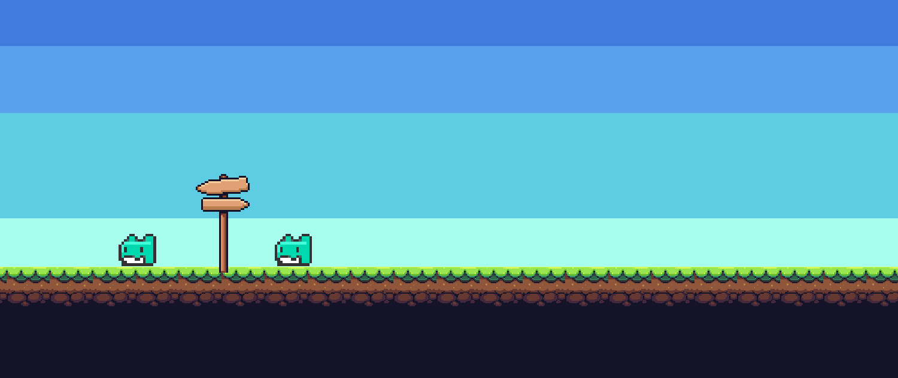
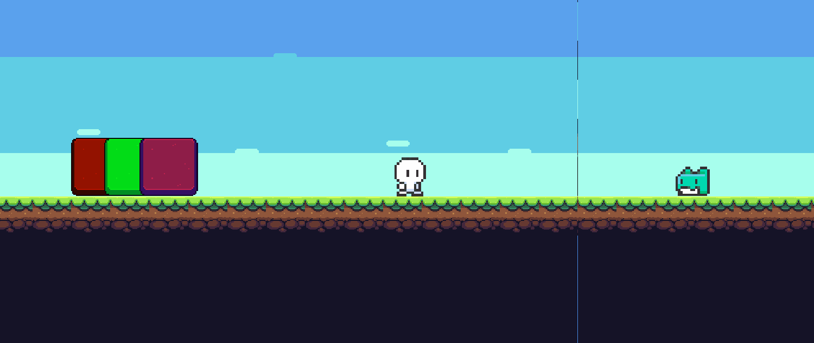
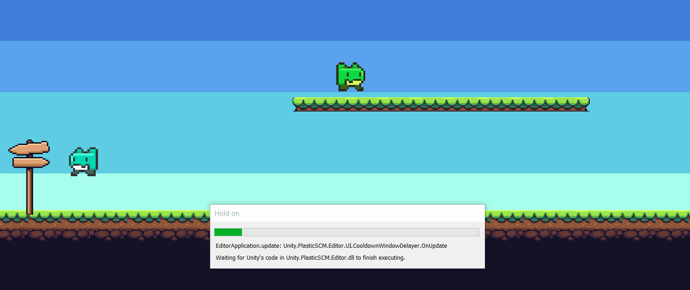
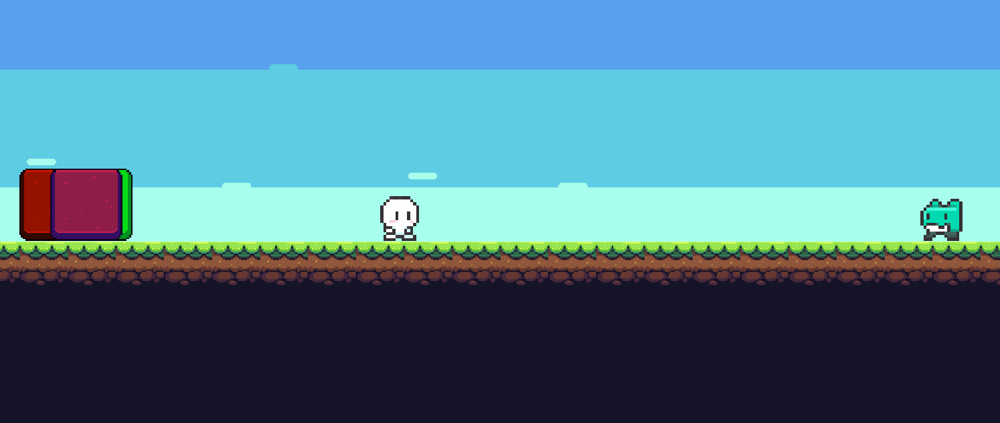
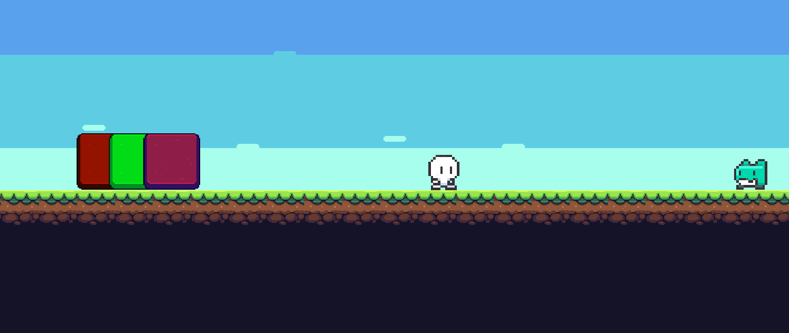

# Controlador-de-camara
## Cámara (A) con seguimiento al jugador. Se debe configurar el seguimiento hacia adelante. Esta cámara es la que debe tener la máxima prioridad.

-> Añadimos una cámara virtual (cámara A) que siga al jugador que controlamos en la escena.

## Cámara (B) con seguimiento a un grupo de personajes que no sean el jugador. La zona donde no se activa el seguimiento debe ser mayor que la del personaje.

-> Añadimos otra cámara virtual (cámara B) que siga a un grupo de 2 enemigos, la cámara intenta centrarse entre los dos.

## Crear una zona de confinamiento para la cámara A que abarque toda la escena.

-> Creamos un objeto con un Polygon Collider 2D que abarca una zona de la escena, cuando intentamos salir la cámara no nos sigue.

## Se debe crear una zona de confinamiento de la cámara B que abarque una parte de la escena.

-> Creamos otro objeto con un Polygon Collider 2D con otra zona de la escena para la cámara B, empujando al enemigo vemos que la cámara no la sigue una vez fuera del collider.

## Añadir un objeto que genere una vibración en la cámara cuando A choca con él.

-> Añadimos el script Cinemachine Collision Impulse source, de modo que cuando nos chocamos con el enemigo, se genera una vibración.

## Agregar una tercera cámara (C) que siga a un personaje que no sea el jugador (sólo uno).

-> Agregamos otra cámara virtual (cámara C) para otro personaje de la escena.

## Seleccionar un conjunto de teclas que permitan hacer el cambio entre las cámaras A y C . (Habilitar/Deshabilitar el gameobject de la cámara virtual)

-> Desde un script hacemos una referencia a las cámaras virtuales y con los botones F1, F2 y F3 cambiamos la prioridad de las cámaras para cambiar entre ellas.

## Extra: Generar una vibración en la cámara cada vez que se pulse la tecla de disparo. Agregar un perfil de ruido a la cámara, y modificar las propiedades de amplitud y frecuencia al component Noise

-> Desde el script, cambiamos el Noise de la cámara A a un ruido (noise) que he creado cada vez que pulsamos la tecla E, si dejamos de pulsarla cambia a null.

